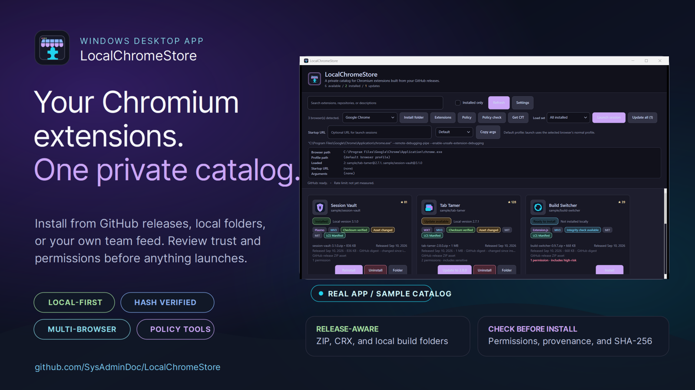
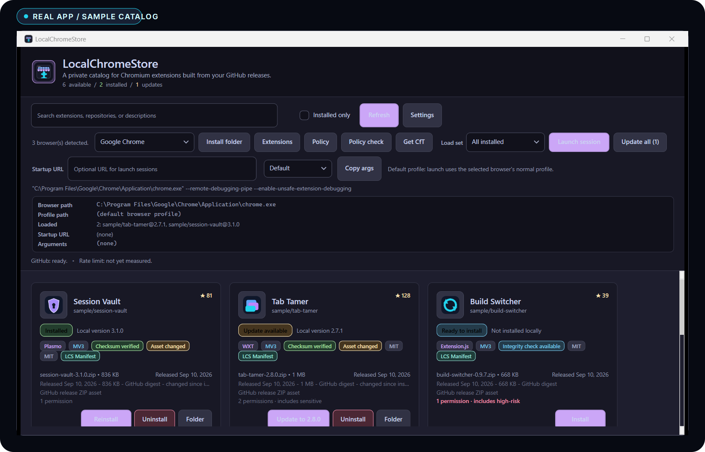
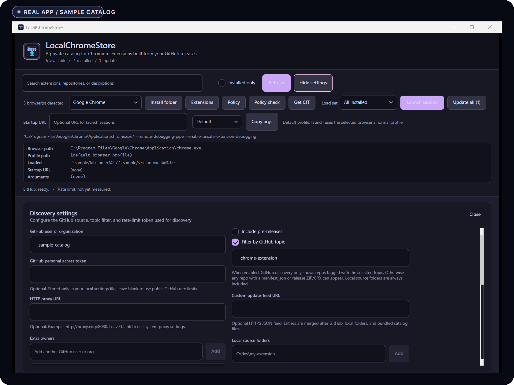

[](https://github.com/SysAdminDoc/LocalChromeStore/releases/latest)
[](LICENSE)
[](https://github.com/SysAdminDoc/LocalChromeStore/releases/latest)
[](https://dotnet.microsoft.com/download/dotnet/9.0)

# LocalChromeStore

LocalChromeStore turns the Chromium extensions you control into a private Windows catalog. Pull builds from GitHub Releases, link unpacked folders while you work, or share a small HTTPS feed with your team. Every install keeps its source, permissions, checksum status, and update state visible.

[Download LocalChromeStore for Windows](https://github.com/SysAdminDoc/LocalChromeStore/releases/latest/download/LocalChromeStore-v0.4.2-win-x64.zip) | [SHA-256 checksum](https://github.com/SysAdminDoc/LocalChromeStore/releases/latest/download/LocalChromeStore-v0.4.2-win-x64.zip.sha256.txt) | [Release notes](https://github.com/SysAdminDoc/LocalChromeStore/releases/latest)

The release is a portable ZIP and requires the [.NET 9 Desktop Runtime](https://dotnet.microsoft.com/download/dotnet/9.0).

## See the app



*Real application capture using clearly marked sample catalog data.*



*Real application capture. The owner, feed, and local folder values are examples.*

## Why it exists

Chromium development still makes you choose between repeated file picker work, a public store submission, or managed browser policy. LocalChromeStore gives extension makers one place to discover builds, inspect what changed, and launch a useful test session.

It is built for personal extension libraries, test machines, and small internal catalogs. Nothing requires a hosted account.

## What it handles

| Job | What you get |
| --- | --- |
| Find builds | GitHub discovery, local source folders, local catalog files, and one optional HTTPS JSON feed |
| Review trust | SHA-256 verification, release provenance, package risk checks, and permission change review |
| Install and update | Managed ZIP or CRX extraction, linked development folders, per-item updates, and Update all |
| Launch browsers | Chrome, Edge, Brave, Vivaldi, Opera, Chromium, and cached Chrome for Testing builds |
| Reuse environments | Named load sets plus JSON import and export without your GitHub token |
| Manage policy | CRX3 packaging, `update.xml`, browser policy health checks, and targeted rollback |

LocalChromeStore also keeps an in-app activity log, writes crash reports to disk, and performs network and extraction work away from the UI thread.

## Install

1. Download `LocalChromeStore-v0.4.2-win-x64.zip` from the [latest release](https://github.com/SysAdminDoc/LocalChromeStore/releases/latest).
2. Download the published SHA-256 file if you want an independent package check.
3. Extract the ZIP to a folder you control.
4. Run `LocalChromeStore.exe`.

Open **Settings**, enter a GitHub user or organization, then select **Refresh**. A token is optional for public repositories. Adding one raises the GitHub API limit and lets the app read repositories the token can access. It is protected with Windows DPAPI before it is saved.

## Catalog sources

Sources are merged into a single set of cards. Duplicate entries are resolved by repository and version.

### GitHub Releases

The app checks the configured owners for a release ZIP or CRX. When no release asset is available, it can inspect common locations for `manifest.json`. Archived repositories and projects without a useful extension source stay out of the catalog.

The optional topic filter defaults to `chrome-extension`.

### Local development folders

Add a folder that contains `manifest.json` to link an unpacked build directly. The source stays in place, so edits are available on the next launch without copying another package. A file watcher reports local changes.

### Local catalog files

Put JSON files in either location:

```text
%APPDATA%\LocalChromeStore\catalogs\
<application folder>\catalogs\
```

A catalog entry can provide the owner, repository name, display name, version, description, project URL, and HTTPS asset URL.

### Custom HTTPS feed

Set **Custom update-feed URL** to merge a shared JSON catalog after GitHub and local sources. The endpoint must use HTTPS. Feed size is limited to 16 MB, and package URLs are validated before they become install targets.

```json
{
  "schemaVersion": 1,
  "extensions": [
    {
      "owner": "example-team",
      "name": "tab-tool",
      "displayName": "Tab Tool",
      "version": "2.4.0",
      "description": "A private extension build.",
      "url": "https://github.com/example-team/tab-tool",
      "assetUrl": "https://downloads.example.com/tab-tool-2.4.0.zip",
      "assetName": "tab-tool-2.4.0.zip",
      "assetDigest": "sha256:YOUR_HEX_DIGEST"
    }
  ]
}
```

## Installing and updating

Select **Install** on a card. Release packages are downloaded to a managed version folder. Local sources are linked instead. The card records whether the build came from GitHub, a local folder, a catalog file, or your HTTPS feed.

When a newer build appears, LocalChromeStore compares its manifest with the installed copy. Permission expansions require review. Optional automatic updates skip builds that request additional access.

## Browser sessions

Choose a detected browser, pick a profile mode, then select **Launch session**.

- **Default** uses the browser's normal profile.
- **Persistent** reuses a LocalChromeStore profile for that browser and load set.
- **Clean temp** creates a fresh profile for the session.

The launch plan adapts to the browser version. Older Chromium builds accept `--load-extension`. Newer branded Chrome builds can use the DevTools `Extensions.loadUnpacked` path. The debug panel shows the resolved executable, profile, active extensions, startup URL, and arguments before launch.

**Get CfT** downloads the latest stable Chrome for Testing build to the local cache. The conformance check can probe detected browsers with a small MV3 fixture and save a report for troubleshooting.

## Trust and policy controls

Checksum sidecars and GitHub release asset digests are checked when available. A mismatch stops the install. The package scanner flags Manifest V2 packages, remote executable code, dynamic evaluation patterns, risky content security policy, possible embedded secrets, and known malicious extension IDs.

Managed Windows machines can use the policy workflow to package CRX3, create or copy `update.xml`, and write matching browser policy entries after review. The health check covers the update feed and package. **Rollback** removes only the selected extension's registry entries and leaves local artifacts intact.

## Local data

| Location | Contents |
| --- | --- |
| `%APPDATA%\LocalChromeStore\` | Settings, installed records, load sets, policy keys, and local catalogs |
| `%LOCALAPPDATA%\LocalChromeStore\extensions\` | Managed extension versions |
| `%LOCALAPPDATA%\LocalChromeStore\profiles\` | Persistent and temporary browser profiles |
| `%LOCALAPPDATA%\LocalChromeStore\cache\` | Icons, Chrome for Testing, and policy risk data |
| `%LOCALAPPDATA%\LocalChromeStore\logs\` | Activity, crash, diagnostics, and conformance reports |

Set `LOCALCHROMESTORE_DATA_ROOT` to redirect roaming and local state under one isolated folder. This is useful for test rigs and portable validation. Set `LOCALCHROMESTORE_SOFTWARE_RENDERING=1` only when an offscreen WPF environment needs software rendering.

## Build from source

```powershell
git clone https://github.com/SysAdminDoc/LocalChromeStore.git
cd LocalChromeStore
dotnet restore LocalChromeStore.sln
dotnet build LocalChromeStore.sln -c Release --no-restore
dotnet test LocalChromeStore.sln -c Release --no-build
dotnet run --project src/LocalChromeStore/LocalChromeStore.csproj -c Release
```

The app uses WPF on .NET 9 with MVVM. Octokit handles GitHub API access. Tests cover discovery, installs, browser loading, policy packaging, persistence, catalog feeds, and startup with cached data.

## Roadmap and help

Current work is listed in [ROADMAP.md](ROADMAP.md). For a bug or feature request, [open an issue](https://github.com/SysAdminDoc/LocalChromeStore/issues).

If LocalChromeStore saves you time, you can [support continued work on Ko-fi](https://ko-fi.com/X8K126YVER).

## License

[MIT](LICENSE)
