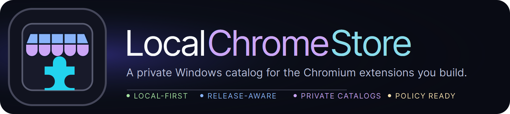

<p align="center">
  
</p>

<h1 align="center">
  
  &nbsp;LocalChromeStore
</h1>

<p align="center">
  <a href="https://github.com/SysAdminDoc/LocalChromeStore/releases"></a>
  <a href="LICENSE"></a>
  <a href="https://github.com/SysAdminDoc/LocalChromeStore"></a>
  <a href="https://dotnet.microsoft.com/"></a>
</p>

> **A personal store for the Chromium extensions you build yourself.**
> Lists every extension across your GitHub repos, downloads the latest release ZIP/CRX, and loads them into Chrome / Brave / Edge with a single click. Install. Uninstall. Move on.

LocalChromeStore exists for one reason: when you build a lot of Chrome extensions, "Load unpacked" gets old fast. This is a native Windows store UI for your own extensions — sourced from your GitHub releases, with proper install / uninstall semantics.

---

## Why it exists

Chromium 75+ blocks drag-and-drop install of self-signed CRX files with `CRX_REQUIRED_PROOF_MISSING` — even with developer mode on, even with a valid signing key. The official paths are:

1. **Chrome Web Store** — useful for shipping, awful for testing your own dogfood
2. **Load unpacked** — works, but clicking through the file picker for ten extensions every browser reset is friction
3. **Enterprise Policy `ExtensionInstallForcelist`** — the only self-host path that actually works on managed Chrome / Brave / Edge machines

LocalChromeStore wraps path 2 with a real store UI today. It also wires path 3 for managed machines: package/sign CRX3, generate or copy `update.xml`, write browser policy with consent, health-check the feed, and roll back only matching registry entries.

---

## Features

- **GitHub-sourced discovery** — lists every repo with a `manifest.json` or a release ZIP / CRX asset for any user or org
- **Store-style cards** — extension logo, name, version, description, install / uninstall buttons, link to repo
- **One-click install** — downloads the latest release ZIP, extracts to a managed folder, tracks it
- **Integrity verification** — fails closed on SHA-256 sidecars, and falls back to GitHub release asset `sha256:` API digests when no sidecar exists
- **One-click uninstall** — wipes the local copy and removes it from the load list
- **Browser launcher** — fires Chrome / Brave / Edge / Vivaldi / Opera / Chromium with every installed extension, version-gating the load strategy (plain `--load-extension`, the Chromium 137+ `--disable-features` override, or CDP `Extensions.loadUnpacked` over `--remote-debugging-pipe` for branded Chrome 142+, which removed command-line extension loading)
- **Chrome for Testing tooling** — detects cached Chrome for Testing builds and offers a **Get CfT** action that downloads the latest Stable Windows build into LocalChromeStore's cache for extension-load testing
- **Browser loading conformance** — opt-in **Conformance** action creates a tiny MV3 fixture extension, launches every detected browser/Chrome for Testing build in an isolated profile, records strategy/arguments/CDP IDs or errors, and writes JSON/text reports into diagnostics logs
- **Guided Enterprise Policy workflow** — per-card **Policy** / **Rollback** actions package CRX3 with RSA-2048, run local package-risk preflight checks, generate or copy self-hosted `update.xml`, map Chrome / Edge / Brave / Chromium `ExtensionInstallForcelist` registry targets, write Edge `ExtensionSettings.override_update_url`, check policy/update/CRX health, and roll back registry entries without deleting packaged artifacts
- **Auditable launch sessions** — optional startup URL, default/persistent/clean-temp browser profile modes, and a copyable launch command preview
- **Environment portability** — export/import installed extension targets and portable discovery settings as JSON
- **Update workflow** — update-available badges, permission-change review, manual **Update all**, optional auto-update on refresh, and optional launch-after-install
- **Self-update check** — on launch, compares the running build to the latest GitHub release and shows a dismissible banner with a download link when a newer version is available (never auto-installs itself)
- **Search and filter** — by name, repo, or description; toggle to show only installed
- **Topic filter (optional)** — restrict discovery to repos tagged with a specific GitHub topic (default `chrome-extension`)
- **Optional GitHub PAT** — unauthenticated GitHub API caps at 60 req/h; a personal access token raises that to 5,000/h, unlocks private repos, and is stored with Windows DPAPI
- **Catppuccin Mocha dark theme** — easy on the eyes; light theme planned
- **Activity log + crash log** — every install / uninstall / launch is logged in-app and to disk
- **Async** — every API call, download, and extraction runs off the UI thread

---

## Install

### From release (recommended)

1. Grab the latest `LocalChromeStore-vX.Y.Z.zip` from the [Releases page](https://github.com/SysAdminDoc/LocalChromeStore/releases)
2. Extract anywhere
3. Run `LocalChromeStore.exe`

Requires the .NET 9 Desktop Runtime (the installer prompts if missing).

### From source

```bash
git clone https://github.com/SysAdminDoc/LocalChromeStore.git
cd LocalChromeStore
dotnet build src/LocalChromeStore/LocalChromeStore.csproj -c Release
dotnet test LocalChromeStore.sln -c Release
./src/LocalChromeStore/bin/Release/net9.0-windows/LocalChromeStore.exe
```

---

## Usage

1. **Click Settings** in the top right
2. Set **GitHub user / org** to your handle (defaults to `SysAdminDoc`)
3. *(Optional)* Paste a GitHub personal access token to raise rate limits and surface private repos
4. *(Optional)* Enable **Filter by topic** if you want to limit to repos tagged with `chrome-extension`
5. Click **Save settings**, then click **Refresh**

Every qualifying repo appears as a card. Click **Install** on a card — LocalChromeStore downloads the latest release ZIP/CRX, extracts it to `%LOCALAPPDATA%\LocalChromeStore\extensions\<owner>\<repo>\<version>\`, and registers it.

When installed extensions have newer catalog versions, their cards show **Update available**. Use the card's update button for one extension, or **Update all** to replace every installable outdated local copy. If an update adds required permissions, optional permissions, host access, or optional host access, LocalChromeStore shows the diff and asks for approval first. **Auto-update on refresh** skips permission-expanding updates so new extension access is not accepted silently.

To load installed extensions into a browser:

1. Pick the browser from the dropdown, or click **Get CfT** to download/select the latest Stable Chrome for Testing build
2. *(Optional)* Enter a startup URL to open after the extensions load
3. Pick a **Browser profile mode**: **Default** uses the browser's normal profile, **Persistent** reuses a LocalChromeStore profile for the selected browser/load set, and **Clean temp** creates a fresh isolated profile under `%LOCALAPPDATA%\LocalChromeStore\profiles\temp\`
4. Click **Launch session**

LocalChromeStore uses the best supported load strategy for the selected browser: plain `--load-extension` on older/pre-lockdown builds, the Chromium 137+ override where it still works, or CDP `Extensions.loadUnpacked` for branded Chrome builds that removed command-line extension loading. Command-line-loaded extensions can show the browser's standard developer-mode banner; that is normal and not a sign anything is wrong. The extensions persist for that browsing session; close the browser and they unload (which is exactly what you want during dev/test).

Use **Copy args** to copy the exact command LocalChromeStore will run. This is useful when debugging extension load failures or reproducing a launch session outside the app.

To apply Enterprise Policy mode for a managed browser:

1. Install an extension locally, then select Chrome / Edge / Brave / Chromium in the browser dropdown
2. Click **Policy** on that extension card
3. Enter the hosted CRX URL and hosted `update.xml` URL you will publish
4. Generate `update.xml` from the local package, or copy an existing file into the policy package folder
5. Confirm the HKLM browser-policy impact; LocalChromeStore writes the force-install policy and runs health checks

Use **Rollback** on the same card to remove only that extension's browser-policy registry entries. Local CRX/update artifacts and signing keys stay on disk.

Use **Export environment** to save the installed extension set, manifest trust snapshot, GitHub owner list, topic filter, and launch options as a portable JSON file. Use **Import environment** on another machine to apply those discovery settings, refresh GitHub, and install matching ZIP/CRX release assets. If the current catalog release adds permissions compared with the exported snapshot or local installed copy, import asks for approval before installing it. GitHub tokens are never written to the export file.

---

## How discovery works

For each user/org you've configured, LocalChromeStore:

1. Lists their repos via the GitHub API
2. For each repo, checks for a latest release with a `.zip` or `.crx` asset
3. If no release asset, probes for `manifest.json` at common paths (root, `extension/`, `src/`, `dist/`, `public/`)
4. If the manifest is found (in the ZIP or repo), reads `name`, `version`, `description`, and `icons` to enrich the card
5. Caches the icon to `%LOCALAPPDATA%\LocalChromeStore\cache\icons\`

Repos with no manifest and no release ZIP/CRX are skipped — they won't clutter the store. Archived repos are skipped too.

---

## Where things live

| Path | Purpose |
| --- | --- |
| `%APPDATA%\LocalChromeStore\settings.json` | User settings (GitHub user, DPAPI-protected token, preferred browser, launch/update options) |
| `%APPDATA%\LocalChromeStore\installed.json` | Installed-extension manifest |
| `%APPDATA%\LocalChromeStore\policy-keys\` | Persistent CRX3 signing keys for policy packages |
| `%LOCALAPPDATA%\LocalChromeStore\extensions\<owner>\<repo>\<version>\` | Extracted extension files |
| `%LOCALAPPDATA%\LocalChromeStore\policy-packages\<owner>\<repo>\<version>\` | Generated CRX/update.xml policy artifacts |
| `%LOCALAPPDATA%\LocalChromeStore\profiles\persistent\` | Reusable browser profiles for persistent launch sessions |
| `%LOCALAPPDATA%\LocalChromeStore\profiles\temp\` | Clean temporary Chromium profiles created for launch sessions |
| `%LOCALAPPDATA%\LocalChromeStore\cache\chrome-for-testing\` | Downloaded Chrome for Testing builds |
| `%LOCALAPPDATA%\LocalChromeStore\cache\icons\` | Cached extension icons |
| `%LOCALAPPDATA%\LocalChromeStore\cache\policy-risk\malicious-extension-ids.txt` | Optional local malicious-extension ID feed for policy preflight |
| `%LOCALAPPDATA%\LocalChromeStore\logs\` | Crash logs, diagnostics exports, and browser conformance reports |

To start fresh, just delete the two folders.

---

## Architecture

WPF on .NET 9 — MVVM, no third-party MVVM toolkit.

- `Models/` — plain data records (`ExtensionInfo`, `InstalledExtension`, `BrowserInfo`, `AppSettings`)
- `Services/` — `GitHubService` (Octokit wrapper, discovery), `ExtensionService` (download, ZIP / CRX extract, install state), `BrowserLauncher` (browser detection + launch-plan construction), `ChromeForTestingInstaller` (latest Stable CfT metadata/download/extract), `SettingsService` (JSON persistence + DPAPI token protection)
- `ViewModels/` — `MainViewModel` orchestrates everything; `ExtensionCardViewModel` per-card state
- `Views/` — `ExtensionCardView` user control, plus the main window
- `Themes/` — Catppuccin Mocha resource dictionary

CRX files are unpacked by stripping the CRX2/CRX3 header and extracting the inner ZIP — Chrome / Brave / Edge re-sign the unpacked tree on load anyway, so we don't need to verify the signature ourselves.

---

## Roadmap

See [CHANGELOG.md](CHANGELOG.md) for full release history.

**Shipped**

- **v0.2.0** — Named load sets, per-repo hidden-repo restore, accessibility sweep, broader unit tests
- **v0.3.0** — `localchromestore.json` repo manifest + validator, framework build-command dry-run, teal accent token
- **v0.3.1** — CRX3 RSA signing primitives, deterministic extension ID derivation, self-hosted `update.xml` generation, Enterprise Policy registry writer/rollback, policy health checks, version-gated launch strategy, CDP loader groundwork, self-update checks, and hardened local state persistence
- **v0.3.2** — Branded-Chrome launch now wires the CDP `Extensions.loadUnpacked` path, logs returned extension IDs or exact CDP errors, and shows the actual pipe/debug launch command
- **v0.3.3** — Guided Enterprise Policy workflow: per-card package/apply/rollback, generated or selected `update.xml`, Edge `override_update_url`, and post-write health checks
- **v0.3.4** — GitHub release asset API `sha256:` digest verification, with sidecar/API/unverified trust details in risk review, diagnostics, and catalog export
- **v0.3.5** — Browser loading conformance harness with MV3 fixture generation, Chrome for Testing detection, isolated profile probes, CDP result capture, and JSON/text reports linked from diagnostics
- **v0.3.6** — Policy package-risk preflight blocks MV2, remote executable code, dynamic eval/CSP hazards, and known malicious extension IDs before HKLM policy writes
- **v0.3.7** — Release asset provenance on cards, inspect review, catalog/environment exports, and diagnostics, including GitHub asset IDs, upload/update timestamps, uploader/content type/downloads, checksum source, and changed-since-install status
- **v0.3.8** — Persistent per-browser/load-set launch profiles with a Default/Persistent/Clean-temp selector, diagnostics/export persistence, and stable `--user-data-dir` preview/logging
- **v0.3.9** — Optional Chrome for Testing downloader using the official latest-Stable metadata feed, LocalChromeStore cache extraction, browser auto-detection refresh, diagnostics path reporting, and installer unit tests

**Planned**

- Static update hosting automation for policy-ready packages
- Local folder source, custom update-feed source, light theme + accent picker

---

## Contributing

This is built primarily for personal dev/test workflow, but PRs are welcome. Open an issue first if it's a bigger change.

---

## License

[MIT](LICENSE).
